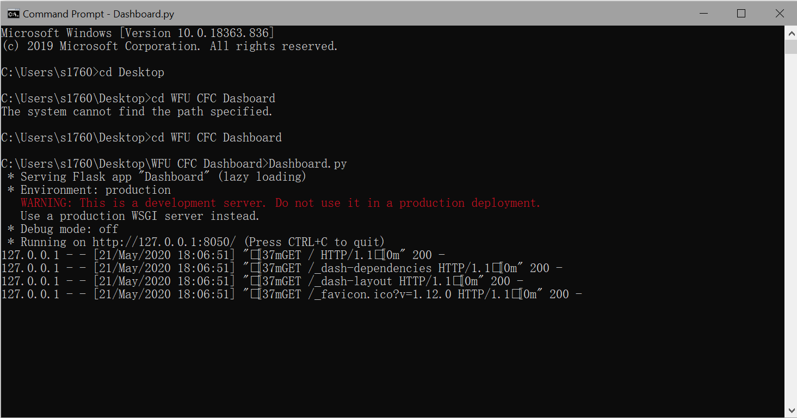
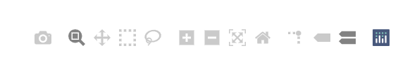
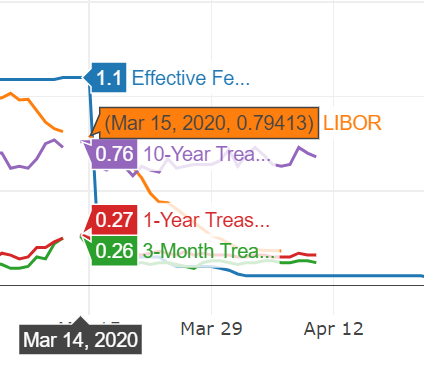
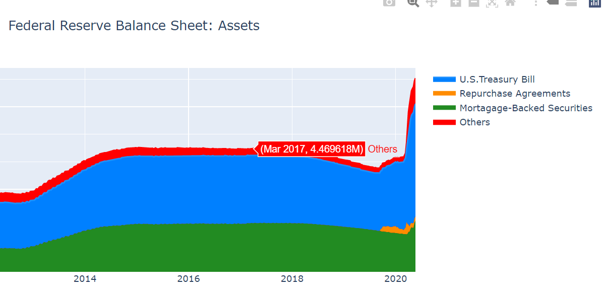
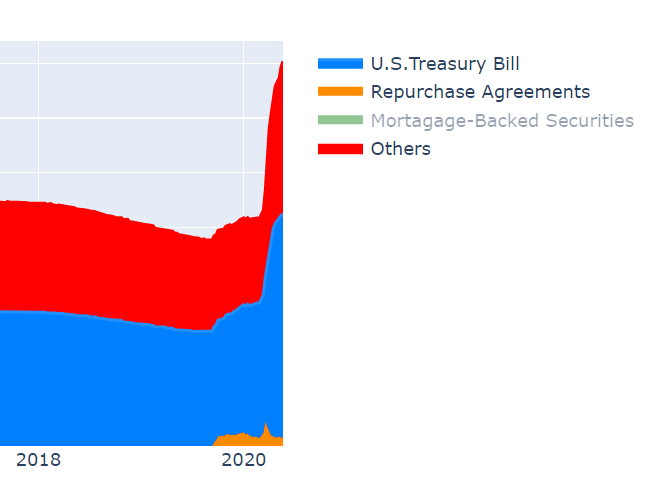

# College-Fed-Dashboards

System Requirement: Any popular operating system can run the script

Python requirement: Python 3.7 or newer versions

* if you don't have python:

  Download python at https://www.python.org/downloads/

* if you don't have pip:

     * if you're on Mac OS: https://www.youtube.com/watch?v=yBdZZGPpYxg
  
     * else if you're on Windows: https://phoenixnap.com/kb/install-pip-windows
  
     * else if you're on Linux: You don't need to read this. You can figure it out yourself.
    
* if you already have pip:

  * download the req.txt in this GitHub repository

  * in your command line/terminal, type cd + foldername to go to the directory that stores req.txt

  *  in your command line/terminal, type:
  
     pip install -r req.txt
  
     and you'll be all set.
   
* How to run the script:
 
    * download the .py file from the GitHub repository

    * run the .py file from the command line/terminal

       * if you don't know how to do this:
   
       * if you are on Windows: https://www.youtube.com/watch?v=n1Q8xs2YC8Q
     
       * else if you are on MacOS: https://www.youtube.com/watch?v=nnpt4L5XezA
     
        after running the script, wait for a while and you'll get an output similiar to this:
  
   
   
    *  copy the link in the output and go to the webpage using your browser

* How to play with this Dashobard:
    * select tools from the toolbar on the top right cornor
    
         * you can zoom in and out and download the picture 
         
    
    * hover on the grpah and it will display the value
    
         
    
    * click the lengend to hide and display a line/curve/area
         
         

* How contribute to the dashboard (you need to learn some basic Git to do this):

    * fork the repository in GitHub
    
    * make changes locally

    * push to your changes to your own copy of the dashboard .py file
        
    * send a pull request to me

 

